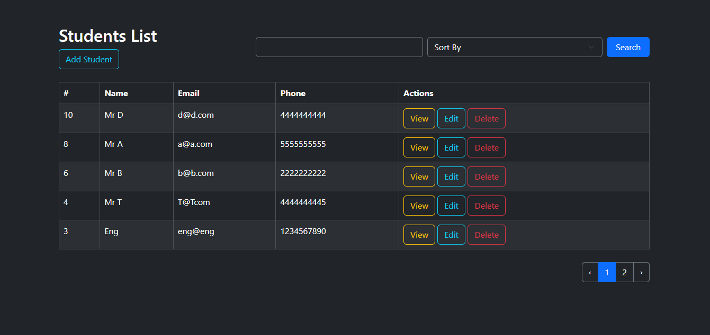
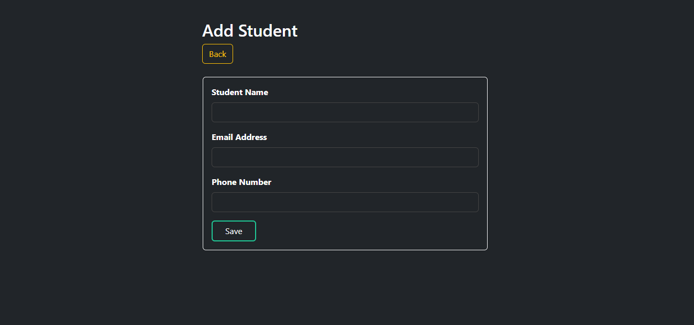
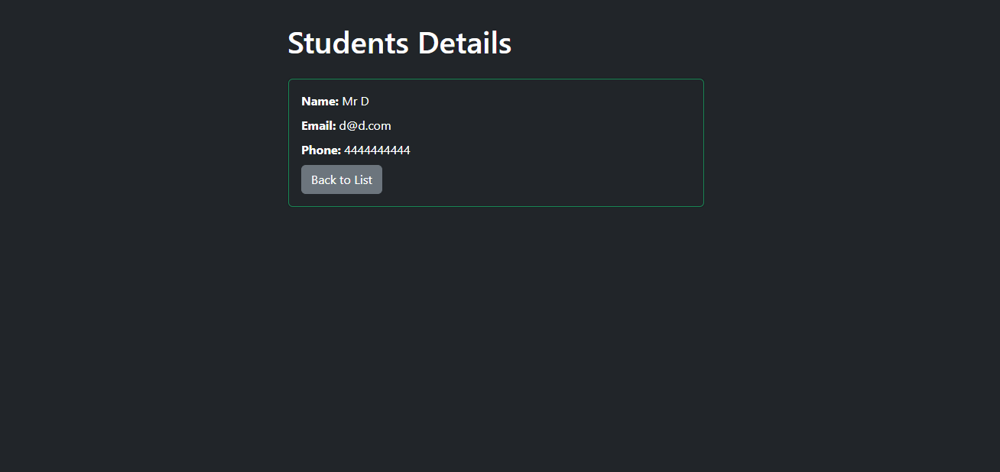
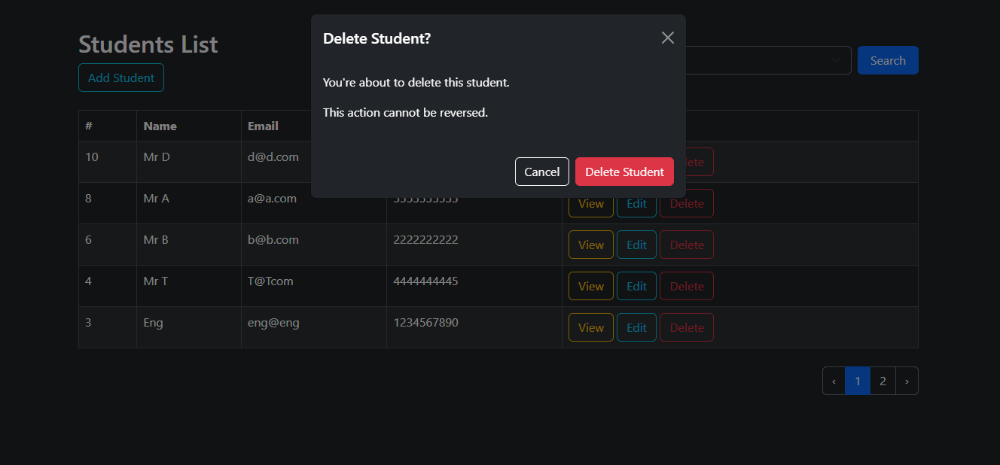
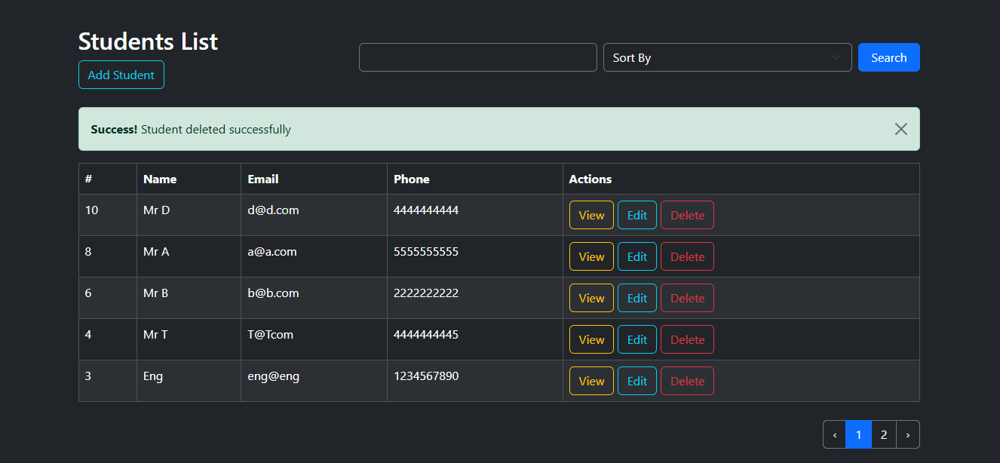
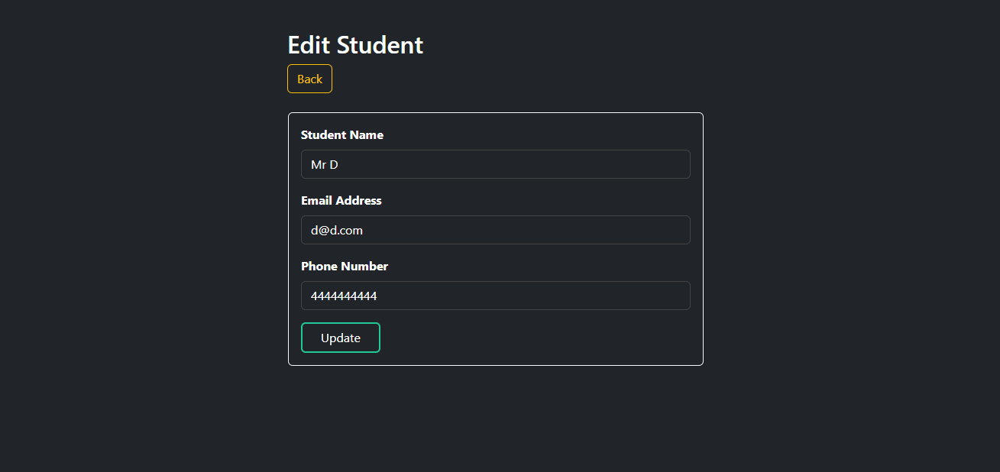
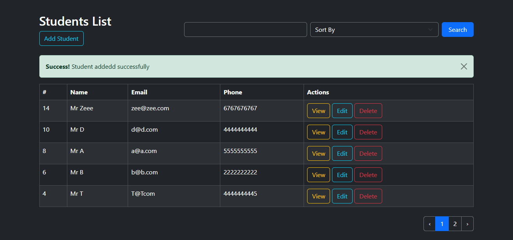
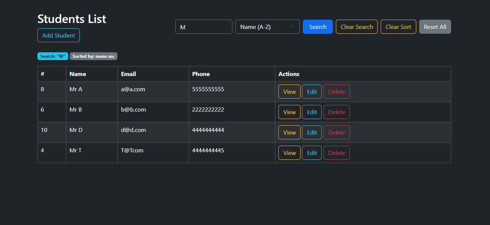
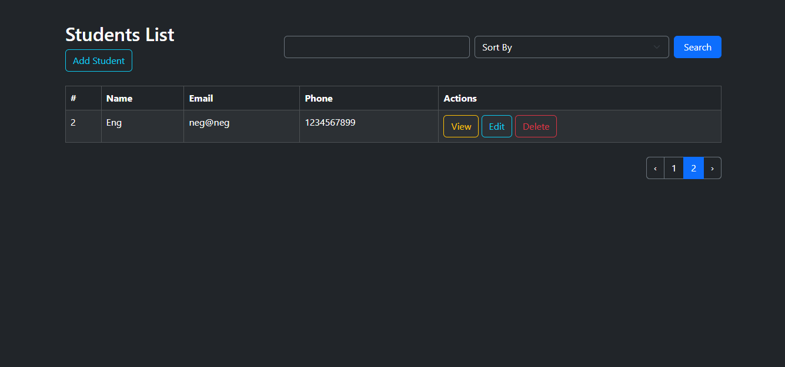

# Student Records Management System

A robust, full-stack Laravel web application designed to streamline the management of student data. This project features a modern "Dark Mode" UI and provides a seamless user experience for managing records with built-in search, filtering, and real-time feedback.

---

## 🚀 Features

* **Full CRUD Operations**: Create, Read, Update, and Delete student records effortlessly.
* **Advanced Search & Filtering**: Quickly locate students by name with persistent search parameters.
* **Dynamic Sorting**: Sort records by Name (A-Z or Z-A) to organize data efficiently.
* **Smart Pagination**: Smooth navigation through large datasets to maintain performance.
* **Data Validation**: Ensures all entries follow the correct format (Email, Phone, etc.).
* **Interactive UI**:
    * Dark theme for reduced eye strain.
    * Confirmation modals for destructive actions (e.g., Deleting a student).
    * Flash notifications for success messages (e.g., "Student added successfully").

---

## 🛠️ Tech Stack

* **Framework**: Laravel 11/12
* **Frontend**: Blade Templating Engine, CSS3, JavaScript (Vanilla/Alpine.js)
* **Database**: MySQL
* **Server**: Artisan Development Server
* **Tools**: Composer, NPM, Git

---

## 📸 Screen Gallery

### 1. Dashboard & Records List
The main dashboard provides a high-level view of all students with quick access to management tools, search, and sorting.


### 2. Add Student
Intuitive forms for capturing student details including Name, Email, and Phone Number.


### 3. Detailed View
A dedicated page to view individual student profiles in a clean, card-based layout.


### 4. Safety First: Delete Confirmation
To prevent accidental data loss, a confirmation modal appears before any record is permanently removed.


### 5. Deleted Student Notification: Delete Student
To delete student


### 6. Edit Student Screen: Edit Student
To successfully edit student


### 7. Added Student Notification: Add Student
To add student succefully


### 8. Filter Student Screen: Filter Student
To search student


### 9. Pagination: Scroll Pages
To scroll through pages


---

## 🗄️ Database Schema

The application uses a streamlined schema designed for high performance and data integrity.

### Students Table Structure

| Column | Type | Constraints | Description |
| :--- | :--- | :--- | :--- |
| `id` | BigInt | Primary Key, Auto-Increment | Unique identifier for each student. |
| `name` | String (255) | Not Null | Full name of the student. |
| `email` | String (255) | Unique, Not Null | Student email (used for identification). |
| `phone` | String (20) | Nullable | Contact number. |
| `created_at` | Timestamp | Nullable | Record creation date. |
| `updated_at` | Timestamp | Nullable | Last update timestamp. |

---

## ⚙️ Backend Logic

### Search & Sort Architecture
The core of the application’s flexibility lies in its controller logic. Instead of simple fetching, the `StudentController` dynamically builds queries based on URL parameters.

**Search & Sort Implementation:**
The search and sort functionality is handled within the `index` method using Laravel's fluent query builder. This allows for "stackable" filters:
* **Search**: Uses a `WHERE ... LIKE` clause to match names partially.
* **Sort**: Validates parameters against an allow-list to prevent SQL injection, then applies `orderBy()`.
* **Pagination**: Automatically handles the `?page=X` logic.

**Example Query Flow:**
When a user searches for "M" and sorts by "Name (A-Z)", the backend executes logic similar to this:

$$\text{Query} = \text{Student::query()} \rightarrow \text{where('name', 'LIKE', '\%M\%')} \rightarrow \text{orderBy('name', 'asc')} \rightarrow \text{paginate(5)}$$

---

## 🧩 Key Architecture Highlights

* **Eloquent ORM**: Clean, readable database queries.
* **RESTful Routing**: Follows standard HTTP verb conventions.
* **Form Request Validation**: Centralized logic for high data quality.
* **Blade Components**: Reusable UI elements to keep the code DRY (*Don't Repeat Yourself*).

### 🔒 Security Measures
* **CSRF Protection**: All forms include `@csrf` tokens to prevent Cross-Site Request Forgery.
* **SQL Injection Prevention**: Using Eloquent ORM ensures all inputs are automatically sanitized.
* **XSS Protection**: Blade’s `{{ }}` syntax automatically escapes HTML entities.
* **Mass Assignment Protection**: Utilizes the `$fillable` property in the Student model.

---

## 📥 Installation

1. **Clone the repository**
   ```bash
   git clone [https://github.com/yourusername/student-records-system.git](https://github.com/yourusername/student-records-system.git)
   cd student-records-system
Install dependencies

Bash
composer install
npm install && npm run dev
Configure Environment

Rename .env.example to .env

Set up your database credentials in the .env file.

Bash
php artisan key:generate
Run Migrations

Bash
php artisan migrate
Start the Server

Bash
php artisan serve
Visit: http://127.0.0.1:8000/students

💡 Usage
Searching: Enter a name in the search bar and click "Search".

Sorting: Use the dropdown menu to toggle between ascending and descending order.

Resetting: Click "Reset All" to clear all filters and search queries instantly.

🛣️ Future Roadmap
[ ] Export student list to PDF/Excel.

[ ] Bulk delete functionality.

[ ] Student profile picture uploads.

© 2026 Student Records System